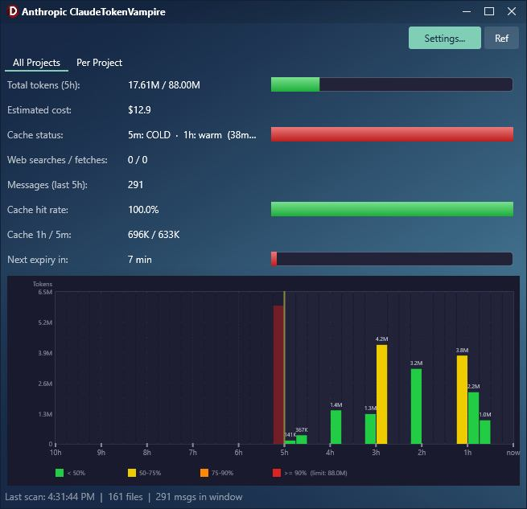

# Claude TokenVampire

An app that monitors your Claude Code token usage in real time.
Anthropic doesn't show you how much of your current 5-hour session quota you've consumed — ClaudeTokenVampire does.

> **Full documentation lives on the website:**
> **[gabrielmoraru.com/my-delphi-code/token-vampire](https://gabrielmoraru.com/my-delphi-code/token-vampire/)**

## How Anthropic's 5-hour window actually works

**Session-based, not sliding.** Your 5-hour clock starts on your first message and runs for exactly 5 hours regardless of activity, at which point the counter hard-resets. The next session starts on the first message after that reset. Anthropic uses the word "rolling" in their docs but means "cycles session-to-session", not "continuously sliding".

Source: [Anthropic support article 12429409](https://support.claude.com/en/articles/12429409-manage-extra-usage-for-paid-claude-plans) — *"if you hit your limit at 2 PM, your next allocation begins at 7 PM, then 12 AM, and so on."*

## What it does

It puts you in control of your Claude Code tokens:
- Tracks **all billable token types**: input, output, cache creation, cache reads
- Shows the **current 5-hour session** with a per-bucket bar chart from `session_start → session_end`
- Color-coded bars: green → yellow → red as you approach your limit
- Estimates **cost** (configurable $/1M token rates)
- Shows **cache hit rate** and warns when the 5-minute cache gap expires
- Counts down until the session **hard-resets** (all tokens reset at once, not gradually)
- Tracks the **7-day weekly cap** with its own configurable limit and ratio bar
- **Top tool calls** — a third tab ranks the tools your sessions hit most over the last 7 days, with calls / cost / avg duration
- Runs quietly in the **system tray** — click the icon to show/hide
- **USES 0 TOKENS by default** — runs entirely offline, no API calls, no Claude queries (the optional auto-ping feature is opt-in and uses a few tokens per ping)

## Features

### Data Engine
- Parses all billable token types: input, output, cache creation, cache read
- Sorts entries by timestamp; skips non-`assistant` entries
- **Detects the current 5-hour session**: first message where no predecessor exists within 5h; session runs for exactly 5h from there
- Aggregates only entries inside `[SessionStart, SessionEnd]` — matches what Anthropic counts
- Per-project breakdown, sorted descending by token usage
- Configurable bucket width (2-60 minutes per chart bar)

### Computed Stats (per session, global and per-project)
- Total tokens: input + output + cache creation + cache read
- Per-type token breakdown
- Message count (assistant turns) in current session
- Cache hit rate: `cache_read / (cache_read + input)`
- Cost estimate in USD (four independently configurable $/1M rates)
- Minutes until session hard-reset (`SessionEnd - Now`)
- Idle minutes since the last message
- Cache gap warning (5m and 1h tier cold/warm detection)
- Cache tier breakdown: 1h ephemeral vs 5m ephemeral tokens
- Web search and web fetch counts
- **7-day total tokens** (true sliding window) with optional weekly cap

### All Projects Tab
- Combined stats across all projects
- Four gradient progress bars: token usage, cache hit rate, session-reset countdown, cache warmth
- Bar chart spanning the current session window (left edge = `SessionStart`, right edge = `SessionEnd`)
- Configurable bucket width
- Color-coded bars: green → yellow → orange → red by % of per-slot budget
- Auto-scale blue mode when no limit is configured
- Token value labels above each active bar
- Y-axis with token count labels
- X-axis with hour offsets (`start`, `+1h`, `+2h`, `+3h`, `+4h`, `end (reset)`)
- 10% horizontal grid lines; vertical hour-mark grid lines
- Legend (color key or auto-scale note)
- Cache status line: shows both 5m and 1h tier state + idle time, color-coded
- **Hot hours warning** (13:00-18:59 local time — Anthropic peak-load window, user-reported)
- Detailed tooltips on every stat label

### Per Project Tab
- Project list: active projects (with token counts) and inactive known projects (gray, separated)
- Per-project stats: tokens, messages, cache hit rate, cost, expiry, cache status
- Per-project bar chart (same renderer, filtered data)
- Selection preserved across automatic refreshes

### Tools Tab
- Top-10 tool calls over the last 7 days
- Three sortable columns: **Calls** / **Cost (est.)** / **Avg ms**
- Lazy refresh: scan only fires when you open the tab — never burns CPU in the background
- Cost attribution: each turn's output tokens split evenly across the turn's tool_uses
- Pairs `tool_use` and `tool_result` JSONL entries for accurate duration measurement

### Auto-Ping (Optional, Opt-In)
- Disabled by default to keep the "0 tokens" promise intact
- Smart trigger: pings Claude only when no session is active, or when the current session is within 30 minutes of its hard-reset
- User-configurable interval (30 to 240 minutes, default 60)
- Spawns `claude -p "hi"` headless via `cmd.exe` — no visible window, detached
- After 3 consecutive spawn failures it disables itself for the run; auto-re-enables when you re-open Settings
- Uses a few tokens per ping (typically <50 output tokens), worth it to start a fresh 5h window before you actually need to work

### Vote Prompt (One-Time)
- After your 3rd launch, asks once whether you want to help shape the next feature
- Three buttons: Vote now (opens GitHub Discussions), Remind me later (7 days), Never (permanent)
- ESC / X-button defaults to "Remind me later" — never re-fires on the same launch

### General UI
- Status bar: last scan time, session files scanned, messages in 5h, active project count
- Manual refresh button
- Settings dialog
- FMX skin / theme picker (multiple built-in skins)
- Auto-refresh timer (configurable interval, default 60 s)
- Form position auto-saved and restored (LightSaber TLightForm)
- User configurable time per bar (default: one bar = 15 minutes)

### Plugin & Distribution
- Claude Code plugin installed via Node.js (no admin required)
- Skill: `/claudetokenvampire:monitor`
- Hook-based **instant launch** (bypasses the model entirely): type _launch vampire_, _start vampire_, or _token monitor_
- Windows directory junctions for skill cache discovery (no admin, zero-copy, stays in sync)
- `Install.cmd` / `Uninstall.cmd` wrappers for double-click install

## Views

- **All Projects** — combined current-session view across everything
- **Tools** — Top-10 tool calls over the last 7 days
- **Per Project** — same chart broken down by project

## Install

1. Copy this folder somewhere permanent (e.g. `C:\Tools\ClaudeTokenVampire`)
2. Double-click `Install.cmd`
3. In Claude Code, run: `/reload-plugins`

**Launch (two ways):**
- **Fast:** Type `launch vampire`, `start vampire`, or `token monitor` in Claude Code (instant, no thinking delay)
- **Skill:** Type `/claudetokenvampire:monitor` in Claude Code (~5 sec, loads full context)

See `How to install.txt` for troubleshooting.

## Requirements

- Windows 10/11
- Claude Code (no API keys needed)
- No external libraries needed

## Platform support

| Platform | Status |
|----------|--------|
| Windows  | Available now |
| macOS    | Coming soon |

The codebase uses FMX (FireMonkey), which is cross-platform. The macOS port mainly requires swapping `%USERPROFILE%\.claude\` for `~/.claude/`.

## Safety

- Opens files in read-only shared mode — never interferes with Claude Code.
- Totally local.
- No data is sent anywhere.
- No tokens are wasted (auto-ping is opt-in and uses only a handful per ping when enabled).
- No API key required.

## Documentation

The **full user manual, settings reference, tips, roadmap and the "How Anthropic Lies To You" essay** are on the website:

**[gabrielmoraru.com/my-delphi-code/token-vampire](https://gabrielmoraru.com/my-delphi-code/token-vampire/)**

## Stars are free

Click the "Star" — but only if you think the project deserves it :)
High-starred projects get priority for new features.

---

*If AI-assisted Delphi development interests you, see my book [Delphi in all its glory – AI-Assisted Development for Delphi](https://www.amazon.com/Delphi-all-its-glory-AI-assisted/dp/B0GTDXDGDK).*
