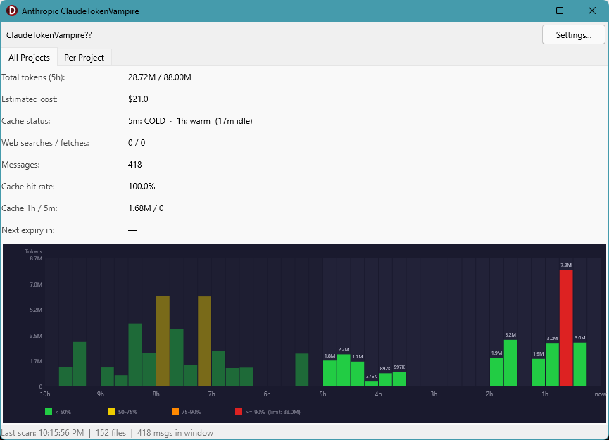

# Claude ClaudeTokenVampire

A system-tray app that monitors your Claude Code token usage in real time.

Anthropic doesn't tell you how much of your 5-hour rolling quota you've consumed — ClaudeTokenVampire does.

## What it does

- Reads Claude Code's local session files (`~/.claude/projects/`)
- Tracks **all token types**: input, output, cache creation, cache reads
- Shows a **5-hour rolling window** with per-hour bar chart
- Color-coded bars: green → yellow → red as you approach your limit
- Estimates **cost** (configurable $/1M token rates)
- Shows **cache hit rate** and warns when the 5-minute cache gap expires
- Counts down until the oldest tokens **evaporate** from the window
- Runs quietly in the **system tray** — click the icon to show/hide
- USES 0 TOKENS! 

## Views

- **All Projects** — combined rolling 5h view across everything
- **Per Project** — same chart broken down by project

## Settings

- Token limit (default 88M — roughly Anthropic's Max 5x tier)
- Cost rates per 1M tokens (input / output / cache read / cache create)
- Refresh interval (default 60s)
- Start minimized
- Start with Windows

## Requirements

- Windows 10/11
- Claude Code (no API keys needed)
- Zero external libraries.

## Platform support

| Platform | Status |
|----------|--------|
| Windows  | Available now |
| macOS    | Coming soon |

The codebase uses FMX (FireMonkey), which is cross-platform. The macOS port mainly requires swapping `%USERPROFILE%\.claude\` for `~/.claude/`.

## License

MIT
